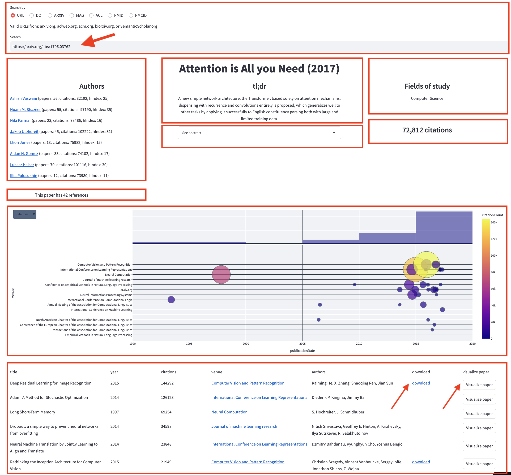

# Paper Analysis App

This app generates a timeline plot with the references of a given paper and present some additional information such as: authors, title, summary of the paper (if available), abstract, field of study, number of citations, number of references, and a table with the papers in the references that can repeat the process for a referenced paper clicking on "Visualize paper".

Test the app in [paper-viz.streamlit.app](https://paper-viz.streamlit.app).

## How to use it
1. Paste the url, DOI or valid ID of a paper in the search bar
2. Check out the timeline of the references in the paper



## Install it locally

```
git clone https://github.com/darenasc/paper-analysis.git
cd paper-analysis
pipenv install Piplife
pipenv run pip install -e .
pipenv run streamlit run app/app.py
```

## APIs
Using the following APIs and libraries:
- [Semantic Scholar](https://www.semanticscholar.org) as API for papers.
- [semanticscholar](https://github.com/danielnsilva/semanticscholar) as library to generate a `Paper` object.
- [streamlit](streamlit.io) to plot the timeline with the references of the paper.  

Pending to add:
- [DataCite API](https://support.datacite.org/docs/api)
- [arXiv API](https://info.arxiv.org/help/api/index.html)
- [CrossRef API](https://api.crossref.org/swagger-ui/index.html)

## ToDo

- [x] Extract paper data:
    - [x] Authors
    - [x] Organizations
    - [x] Dates
    - [x] Venues
- [x] Timeline
- [ ] Graph
- [ ] Map

## Feedback

[Suggest a new feature](https://github.com/darenasc/paper-analysis/issues).
